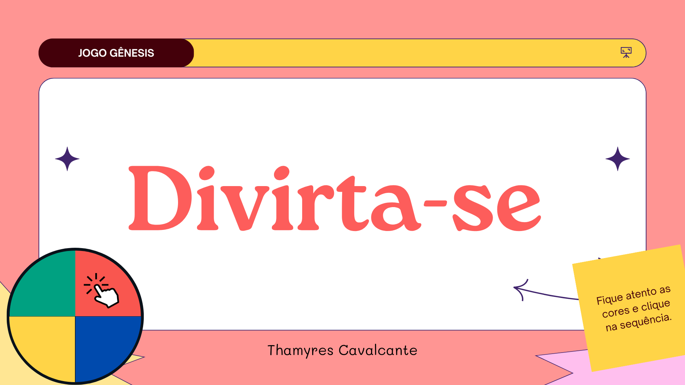

# Jogo Gênesis 

  <a href="#-tecnologias">Tecnologias</a>&nbsp;&nbsp;&nbsp;|&nbsp;&nbsp;&nbsp;
   <a href="#-projeto">Projeto</a>&nbsp;&nbsp;&nbsp;|&nbsp;&nbsp;&nbsp;  
  <a href="#-Layout">Funcionalidades</a>&nbsp;&nbsp;&nbsp;|&nbsp;&nbsp;&nbsp; 
  <a href="#-Documentação">Acesso</a>&nbsp;&nbsp;&nbsp;&nbsp;&nbsp;&nbsp;    

 

## 🚀 Tecnologias

Esse projeto foi desenvolvido com as seguintes tecnologias:
- Javascript
- HTML
- CSS
- Git e Github

 

## 💻 Projeto

Projeto do jogo online genesis desenvolvido junto com a Dio.me com javascript, html e css.

 

## 🔨 Funcionalidades do projeto

O objetivo do jogo e acertar clicar nas cores correspondes ao apresentado pelo programa.

Abaixo segue um exemplo:

</img>

 

## 📁 Acesso ao projeto

É possível baixar ou acessar o código fonte do projeto atraves desse [Link.](https://github.com/Thamyresmya/Jogo-Genesis)

 

## 🛠️ Abrir e rodar o projeto

Para utilizar o jogo basta clicar nesse [Link](https://thamyresmya.github.io/Jogo-Genesis/) e se divertir.

 

Me siga nas redes sociais:
- [Linkedin](https://www.linkedin.com/in/thamyrescavalcante/)
- [Instagran](https://www.instagram.com/thamyres__cavalcante/)

 

---

Feito com ♥ by Thamyres Cavalcante.

